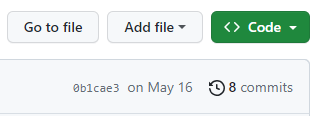
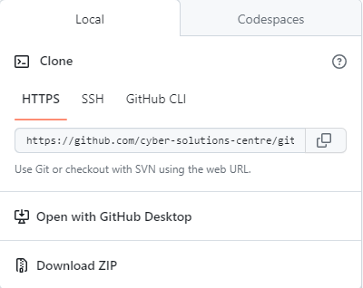
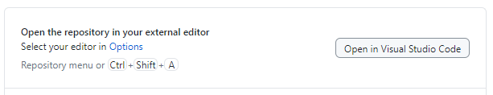

# Learning activity #1: Hello C#

In this activity we are going to write our very first program using the C# programming language. Follow the steps below to complete the activity and complete the extension if you have time.

## 👣 Steps

1. Clone this repository using GitHub Desktop.





2. Open the local repository using Visual Studio Code.



3. Navigate to **activities/1-hello-c-sharp/src** using the explorer and open the **Program.cs** file.

4. Examine the contents of the file. What do you think it will output when we run this program?

5. Run the program. To do this, open a new terminal (`CTRL` + `SHIFT` + `'`), navigate to **activities/1-hello-c-sharp/src** (`cd activities/1-hello-c-sharp/src`), and enter: `dotnet run`. 

6. Examine the contents of the terminal. Is the output of the program what you were expecting?

7. Did you spot the comment in the code (see below). This is ignored by the computer and is just for you. Follow the instruction in the comment.

```c#
// Change the below line so that the program greets C# instead of the world (E.g., Hello, C#!)`
```

8. Save your change and run the program again. Is the output of the program what you were expecting?

🎉 Congratulations! You have just done your first bit of programming. If you have time have a go at the extension, otherwise return to the [main README](https://github.com/cyber-solutions-centre/intro-to-programming/tree/main) where we will dissect this program so that we fully understand it.

## 🔌 Extension

Now that you have made a change to the program and confirmed that it works, commit the change to version control. This is a common workflow for Software Engineers.
